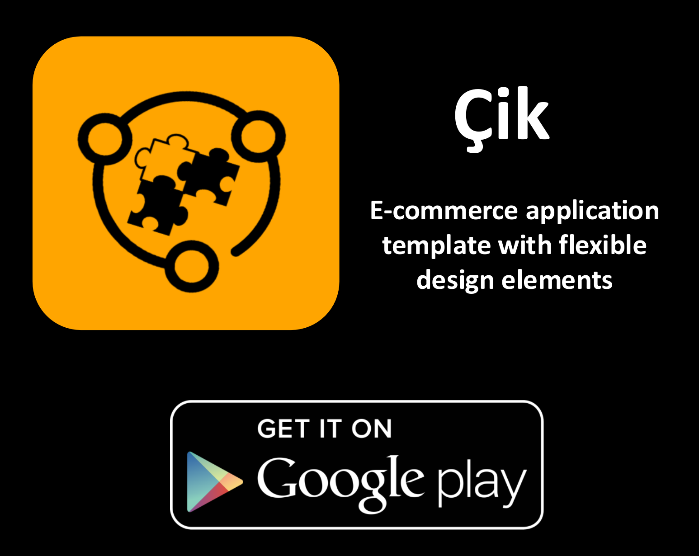
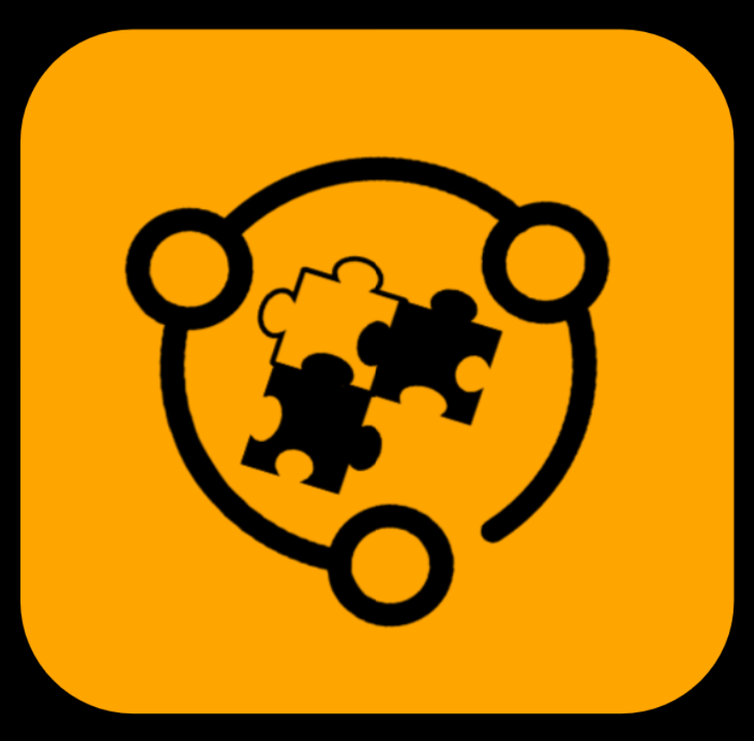
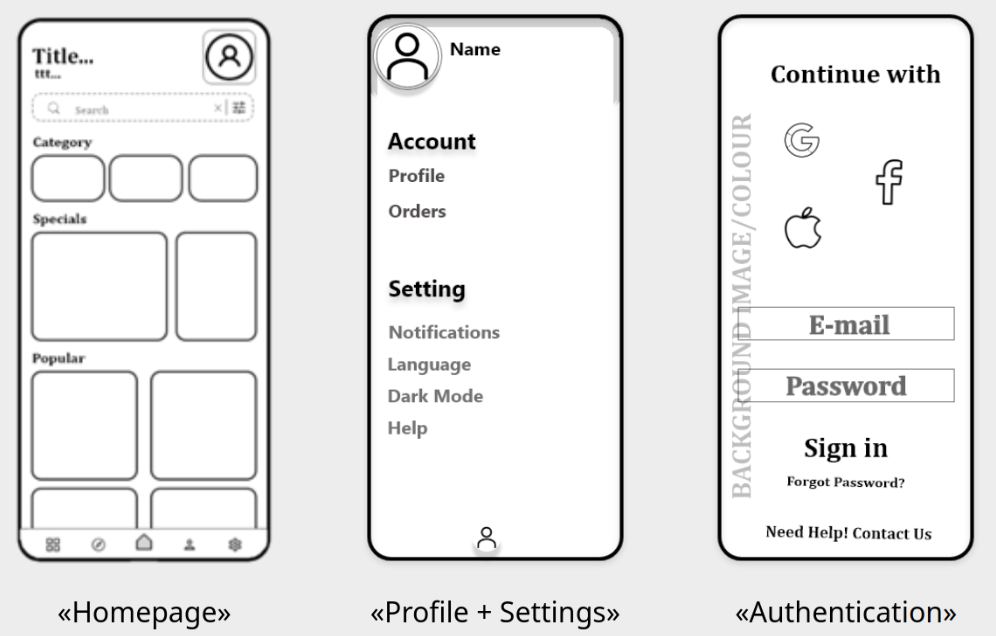
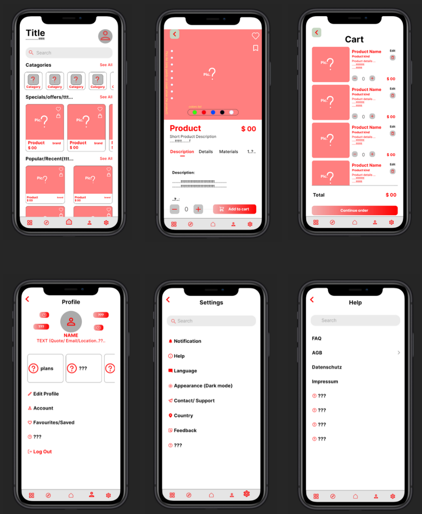
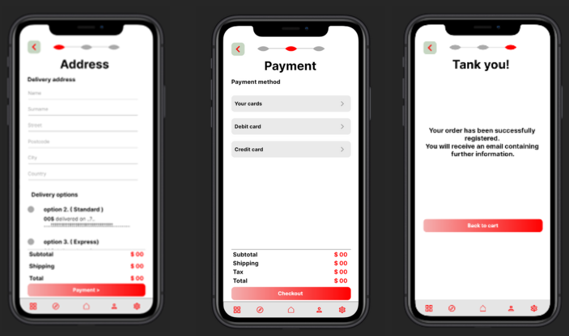
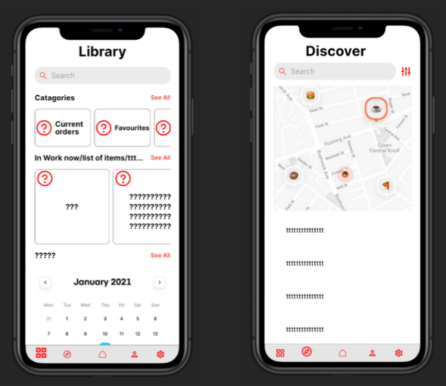

# Çik

**A flexible and modern mobile e-commerce app's design template built with Flutter**

*— Built as a final high school project (Maturaarbeit) —*

## Table of Contents

- [Overview](#overview)
- [Naming & Logo](#naming--logo)
- [Motivation](#motivation)
- [Roadmap](#roadmap)
- [Design](#design)

## Overview

**Çik**, an interactive template for a mobile e-commerce app, was built using `Flutter` and `Dart`. The template is designed to include essential components and features of a typical e-commerce app —  such as the homepage, product listing, and product details screens. 
This template serves as a foundation for building various e-commerce applications.

***Note**: The template is no longer available for download, and there are currently no plans to publish it.*

## Naming & Logo

**Çik** is a name derived from the Kurdish word **Çîk**, meaning **something** or **thing** — *a general object or unspecified item, it could be anything*.

The name is chosen to symbolise and show how any idea can be shaped into a tangible ***thing*** — in this case, an application.

**About the Logo:**
<table>
    <td style="vertical-align: top; width: 60%;">
        <strong>Puzzle pieces</strong> represent modularity, reusability, and seamless integration of a flexible design and its components.
         
         
        <strong>Encircling line and circles</strong> symbolize the development journey and lifecycle of a project.
         
         
        <strong>Open gap in surrounding line</strong> represents the possibility of easy modification and expansion.
    </td>
    <td style="text-align: right; width: 30%;">
      
    </td>
</table>

## Motivation

This project was driven by curiosity and a desire for self-directed learning. My goals included:
- Learn and gain hands-on experience in programming
- Understand and learn the principles of software development
- Explore design principles and concepts
- Make the transformation of an idea into a product (app) easy and seamless
- Document and share the process to enable, inspire, and guide other beginners to realise their own ideas
- Develop a product by myself, driven by personal ambition

## Roadmap
Here is a brief overview of the milestones:
- Research and choose appropriate tools
- Learn `Dart` and `Flutter` by building a simple flashlight app -> [**Cöcu**](https://github.com/Leyiztokvan/coecu_app)
- Test and publish the flashlight app on the Play Store
- Study UI/UX design principles 
- Design the interface and user flow for **Çik**
- Develop and prototype the app template
- Publish a first version of **Çik** on the Play Store

 

**More Details**:

- Further details about the development process and theoretical background are available in the [project paper](high_school/paper.pdf).
- The high school presentation can be here [project presentation](high_school/presentation.pdf).

    *! Please note the paper and presentation are in **German***.

## Design 
### Wireframes
*Few pages from the wireframes:*

### Mockups
*Mockups illustrating the visual direction and user interface:*

